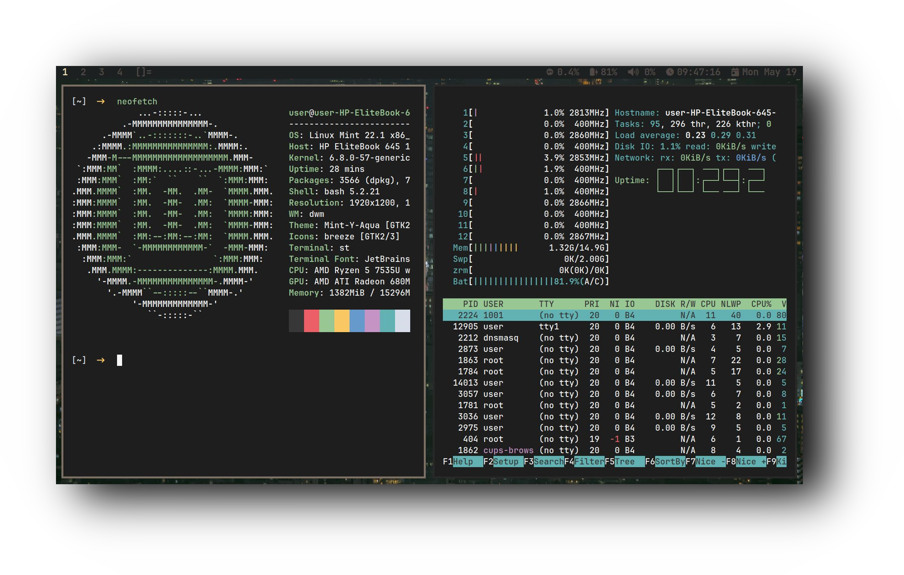
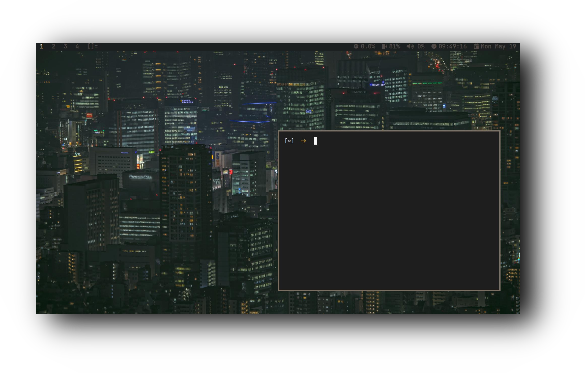
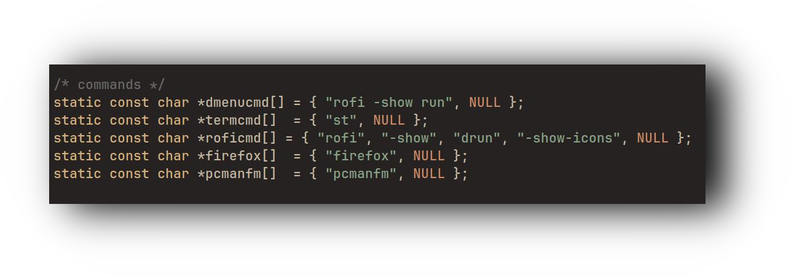

&nbsp;&nbsp;&nbsp;&nbsp;&nbsp;&nbsp;&nbsp;&nbsp;&nbsp;

<b>Thanks for the visit!</b> Welcome to the <b>Dwm Gruvbox edition ️‍🔥</b>! Carefully designed with usability and functionality in mind, while being light on resources!

  <h2 style="font-size: 54px;">
    <strong>
      <a href="https://suckless.org/" style="text-decoration: none; color: inherit;">
        
        Dynamic Window Manager
      </a>
    </strong>
  </h2>

  

  <h3>⚙️ Features</h3>
  <ul>
    <li><strong>Window Manager</strong> :bento: <a href="https://dwm.suckless.org/">Dwm</a></li>
    <li><strong>Application Launcher</strong> :rocket: <a href="https://tools.suckless.org/dmenu/">Dmenu</a></li>
    <li><strong>Terminal</strong> :leaves: <a href="https://st.suckless.org/">St</a></li>
    <li><strong>Shell</strong> :shell: <a href="https://fishshell.com/">Fish</a></li>
    <li><strong>File Manager</strong> :flower_playing_cards: <a href="https://github.com/lxde/pcmanfm">PcmanFM</a></li>
  </ul>

  

 

  <h2 style="font-size: 48px; color: #4CAF50;"><strong>💻 Dynamic Window Manager (DWM)</strong></h2>
  

    

      

        ⚡ 
        DWM is a dynamic window manager for X11 that is optimized for performance. It's extremely lightweight and efficient, perfect for users who want a fast, minimal, and fully customizable environment.
      

    

    
    
  

# Dwm-Panel
### A custom made Python-based panel for dwm

## ⚙️ 𝙁𝙚𝙖𝙩𝙪𝙧𝙚𝙨

  -  𝗗𝗲𝘃𝗲𝗹𝗼𝗽𝗲𝗱 𝗳𝗿𝗼𝗺 𝗦𝗰𝗿𝗮𝘁𝗰𝗵 ⚙️
  -  𝗪𝗿𝗶𝘁𝘁𝗲𝗻 𝗶𝗻 𝗣𝘆𝘁𝗵𝗼𝗻 🐍
  -  𝗟𝗶𝗴𝗵𝘁𝘄𝗲𝗶𝗴𝗵𝘁 𝗮𝗻𝗱 𝗙𝗮𝘀𝘁 ⚡

  

  <h3>🔑 Key Bindings</h3>
  <ul>
    <li><strong>Super+q</strong> – Kill - Qurrent Application</li>
    <li><strong>Super+t</strong> – Open st - Terminal</li>
    <li><strong>Super+d</strong> – Open rofi - Application Menu</li>
    <li><strong>Super+f</strong> – Open Firefox - Browser</li>
    <li><strong>Super+e</strong> – Open PcmanFm - File Manager</li>
    <li><strong>Super+space</strong> – Floating Mode</li>
    <li><strong>Super+shift+p</strong> – Quit Dwm Session</li>
  </ul>

