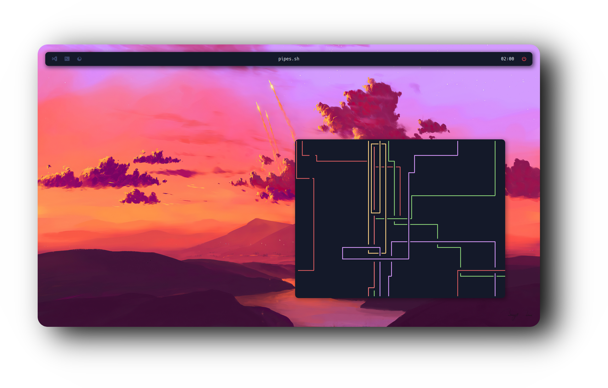

<b>Thanks for the visit!</b> Welcome to the <b>i3 Dark edition ️‍🔥</b>! Carefully designed with usability and functionality in mind, while being light on resources!

  <h2 style="font-size: 54px;">
    <strong>
      <a href="https://i3wm.org/" style="text-decoration: none; color: inherit;">
        i3 Window Manager
      </a>
    </strong>
  </h2>

  

  

 

  

    

      

        ⚡ 
        i3 is optimized for performance. It's lightweight and efficient, perfect for users who want a fast, minimal, and fully customizable environment.
      

    

    
  

