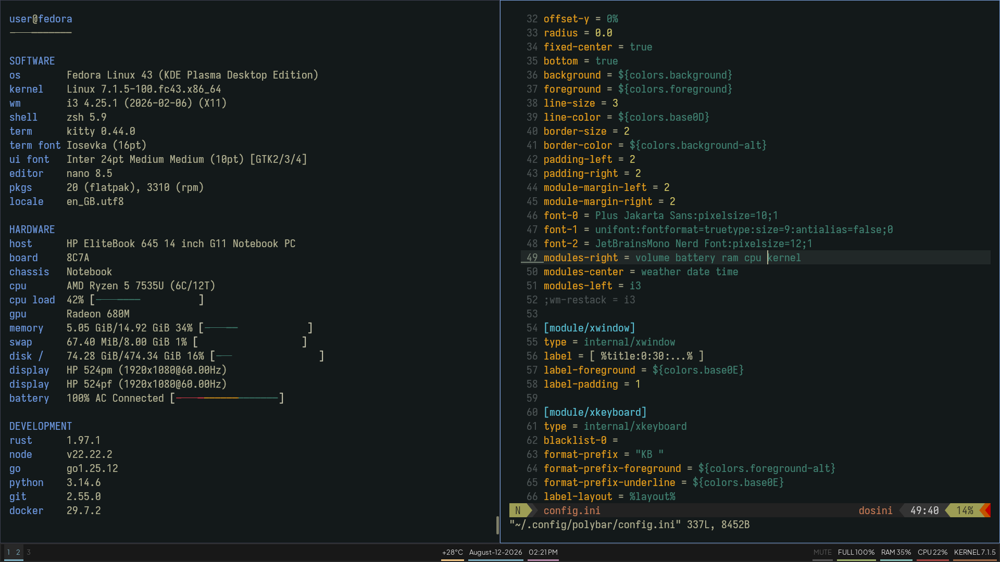
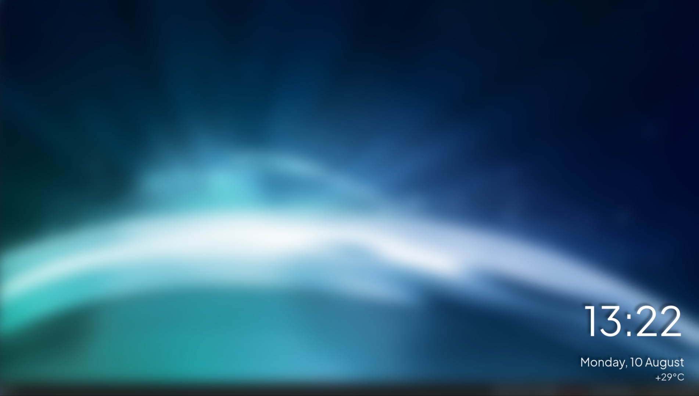

<div align="center">
  
  <h1>🌊 i3 Blue Edition</h1>
  <p><strong>Clean • Minimal • Aesthetic i3wm Dotfiles</strong></p>
  <p>
    
    
    
  </p>
</div>

---

## Overview

A carefully crafted **i3wm** rice focused on a clean blue aesthetic, usability, and low resource usage.  
Includes Polybar, Rofi, Picom, Dunst, Kitty and a custom lockscreen.

---

## Preview

<div align="center">
  
</div>

<br>

<div align="center">
  
</div>

---

## Required Packages

Install the following packages (names may vary slightly depending on your distro):

| Category              | Packages                                                                 |
|-----------------------|--------------------------------------------------------------------------|
| **Window Manager**    | `i3-wm` / `i3`                                                          |
| **Status Bar**        | `polybar`                                                               |
| **Launcher**          | `rofi`                                                                  |
| **Compositor**        | `picom`                                                                 |
| **Notifications**     | `dunst`                                                                 |
| **Terminal**          | `kitty`                                                                 |
| **Lockscreen**        | `i3lock-color` (recommended) or `i3lock`                                |
| **Screenshot / Utils**| `scrot`, `imagemagick`, `flameshot`                                     |
| **Wallpaper**         | `feh`                                                                   |
| **System Utils**      | `brightnessctl`, `playerctl`, `network-manager-applet`, `autorandr`     |
| **Audio**             | `wireplumber` (for `wpctl`)                                             |
| **Other**             | `curl`, `calc`, `dex`                                                   |


## Fonts

Install these fonts for the best experience:

1. **Plus Jakarta Sans**  
   → https://fonts.google.com/specimen/Plus+Jakarta+Sans

2. **Iosevka Nerd Font**  
   → https://github.com/ryanoasis/nerd-fonts/releases/download/v3.5.0/Iosevka.zip

After downloading, place them in `~/.fonts` or `~/.local/share/fonts` and run:

```bash
fc-cache -fv
```

## i3Lock Setup

Copy the lock script to your local bin:

```bash
cp .config/lock ~/.local/bin/lock
```

Make it executable:

```bash
chmod +x ~/.local/bin/lock
```

The lockscreen is bound to Mod + L by default.
