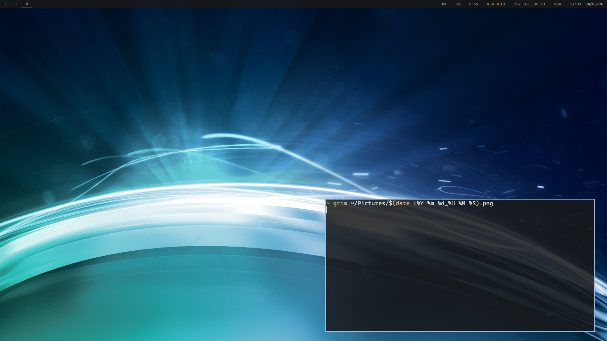

<!-- Banner -->

<!-- Badges -->

  
  

<h3>Aesthetic • Lightweight • Functional</h3>

<b>A clean Sway rice for daily use.</b> 
Carefully crafted for Wayland — minimal, fast, and easy on the eyes.

---

## Table of Contents

- [Showcase](#showcase)
- [Components](#components)
---

## Showcase

  

---

## Components

| Role | Program |
|------|---------|
| Window Manager | [Sway](https://swaywm.org/) |
| Status Bar | [Waybar](https://github.com/Alexays/Waybar) |
| Terminal | [Foot](https://codeberg.org/dnkl/foot) |
| Shell | Zsh + autosuggestions + syntax highlighting |
| Launcher | [Fuzzel](https://codeberg.org/dnkl/fuzzel) |
| Notifications | [Mako](https://github.com/emersion/mako) |
| Compositor | Sway (built-in, Wayland-native) |
| Wallpaper | [swaybg](https://github.com/swaywm/swaybg) |
| Lockscreen | [swaylock](https://github.com/swaywm/swaylock) |
| File Manager | [Ranger](https://ranger.github.io/) |
| Screenshot | [grim](https://sr.ht/~emersion/grim/) + [slurp](https://github.com/emersion/slurp) |
| Idle Daemon | [swayidle](https://github.com/swaywm/swayidle) |

---
