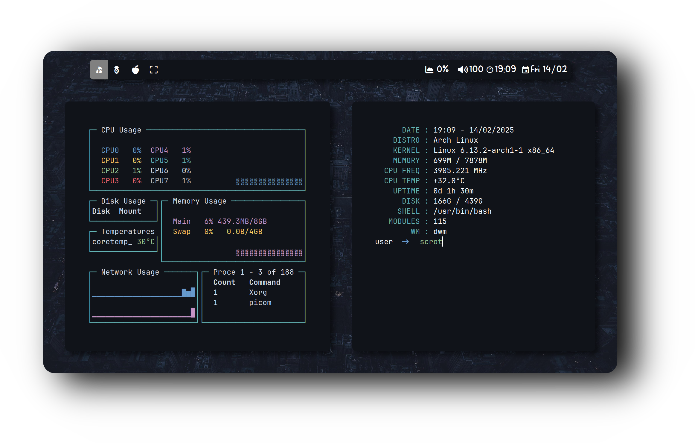

  <h2 style="font-size: 54px;">
    <strong>
      <a href="https://suckless.org/" style="text-decoration: none; color: inherit;">
        
        Dynamic Window Manager
      </a>
    </strong>
  </h2>

  

  <h3>⚙️ Features</h3>
  <ul>
    <li><strong>Window Manager</strong> :bento: <a href="https://dwm.suckless.org/">Dwm</a></li>
    <li><strong>Application Launcher</strong> :rocket: <a href="https://tools.suckless.org/dmenu/">Dmenu</a></li>
    <li><strong>Terminal</strong> :leaves: <a href="https://st.suckless.org/">St</a></li>
    <li><strong>Shell</strong> :shell: <a href="https://fishshell.com/">Fish</a></li>
    <li><strong>File Manager</strong> :flower_playing_cards: <a href="https://github.com/lxde/pcmanfm">PcmanFM</a></li>
  </ul>

  

 

  <h2 style="font-size: 48px; color: #4CAF50;"><strong>💻 Dynamic Window Manager (DWM)</strong></h2>
  

    

      

        ⚡ 
        DWM is a dynamic window manager for X11 that is optimized for performance. It's extremely lightweight and efficient, perfect for users who want a fast, minimal, and fully customizable environment.
      

    

    
  

  

  <h3>🔑 Key Bindings</h3>
  <ul>
    <li><strong>Super+q</strong> – Kill - Qurrent Application</li>
    <li><strong>Super+t</strong> – Open Rxvt - Terminal</li>
    <li><strong>Super+d</strong> – Open Dmenu - Application Menu</li>
    <li><strong>Super+f</strong> – Open Firefox - Browser</li>
    <li><strong>Super+e</strong> – Open PcmanFm - File Manager</li>
    <li><strong>Super+space</strong> – Floating Mode</li>
    <li><strong>Super+shift+p</strong> – Quit Dwm Session</li>
  </ul>

